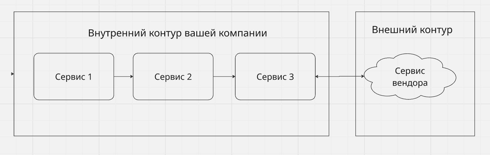
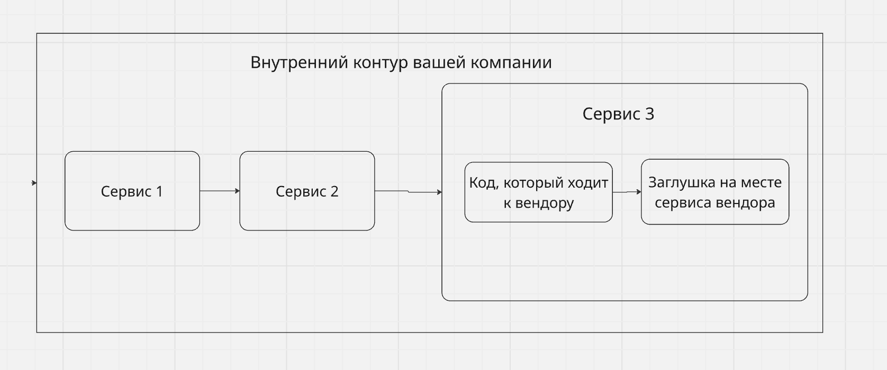
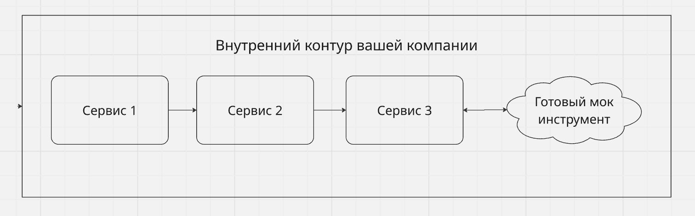
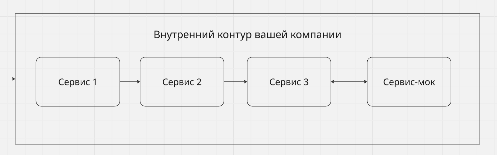

# "Интровертный" подход в тестировании API

## Предисловие:
* Большинство проектов на определенном этапе своего развития сталкивается с тем, что бизнесу требуется внедрить такую диковинную вещицу, которую реализовывать самим: не получится / нельзя / дорого.   
Тут выходят на сцену вендоры и внешние системы, которые готовы спасти ситуацию и предоставить свой функционал на ~~растерзание~~ ласковые поглаживания трафиком нашей компании.
  

* Вроде понятно, как так вообще вышло, что есть какие-то там зависимости, хотя мы все сильные и независимые! Но как же дело обстоит с тестовым покрытием? Тут в общем понимании варианта два: 
  1. Вендор предоставляет тестовый стенд/эмулятор в том или ином виде 
    
  2. Вендор ничего не предоставляет и первое, конечно, лучше, чем второе, но имеет свои нюансы, с которым при тестировании смириться не получится
    

* Мы пропустим этапы развития от мезозоя до решения внедрить авто-тесты в проект и сразу перейдем к тому, как обеспечить: **стабильность, скорость и детерминированность при проверке интеграций с внешними системами**.
  

Так что же за **"интровертный"** подход?  
Идея в том, что бы отвернуться от внешнего мира, и отказаться от зависимостей.  
То есть при тестировании взаимодействия с внешними системами вы не используете походы в реальные тестовые стенды или эмуляторы, а вместо этого ограничиваетесь тестовыми заглушками или соответствующими инструментами в контуре вашего сервиса

## Проблемы экстравертов

На скромный взгляд автора, наиболее оптимальный в обоих случаях вариант: и с наличием тестового стенда и без него — мокирование внешних зависимостей.  
То есть использование заглушек разной степени сложности для тестирования.

Но почему же хочется использовать моки, а не тестовые стенды вендоров (конечно, при условии, что они вообще есть)?
Стоит сказать, что иногда предоставляемый вендором вариант, покрывает ваши потребности в тестировании, 
при этом достаточно стабильный, быстрый и вообще красавчик, можно даже регулярно запускать на нем автотесты и кажется все супер.
Но даже при таких хороших вводных это остается зависимостью, изменение которой может быть очень инертно, если вообще возможно.
А это значит, что все описанные далее проблемы могут стать актуальны и для такого, как кажется с первого взгляда -- позитивного сценария.
А как мы знаем, к проблемам лучше быть готовым до того, как они настанут.

Ключевые проблемы большинства внешних эмуляторов, если таковые предоставляются:

Часто, это — коробочная копия готового решения партнера, звучит как плюс, правда?
Но в реальности из этого вытекают следующие ключевые проблемы:
1. **Стабильность** 
  
Стоит ли говорить, что поведение внешних зависимостей, предоставляемых в роли тестовых болванок часто далеко от идеала?
  
В реальной практике встречались самые разные сценарии, мои любимые, это когда тестовый стенд с не нулевой вероятностью может валидно ответить ошибкой, чтобы партнер, использующий этот стенд для своих тестов мог проверить негативные сценарии.   
Вы могли подумать, что это какой-то особый случай? Но нет, это вполне себе частая ситуация. То есть мы буквально получаем казино -- тест который имеет конкретный ожидаемый результат на действие, у которого этих результатов несколько.
  
О каком доверии к тестам в таком случае может идти речь, если мы знаем, что тесты, которые должны обеспечивать качество нашего продукта — зависят от чего-то такого-же случайного, как указанная цена "до скидки" на товар, который продается по акции.
  
2. **Скорость** 
  
Часть функционала, предоставляемая партнером может быть не востребована нашей компанией и соответсвенно не требует тестирования, то есть наши сервисы или приложения используют не все, что реализует вендор, соответственно то, что нами не востребовано -- не необходимое усложнение.
  
Потенциально, функционал, не используемый в рамках теста только замедляет его (отсылая к предыдущему пункту — еще и может делать его менее стабильным), а скорость для авто-тестов очень важная метрика.
  
3. **Гибкость и настраиваемость** 
  
Предоставляемый эмулятор, обычно, имеет ограниченный набор тестовых данных или вообще может работать только на данных, предоставляемых самим партнером «лично на руки», а из описания раньше мы помним, что влиять на тестовый стенд партнера мы либо не можем совсем, либо в очень ограниченных рамках и далеко не факт, что эти рамки — обеспечат нам то, что нужно для тестирования.
  
А как же быть, если мы хотим запускать тесты на большое количество релизов, а тестов много, а тесты на негативные сценарии, а еще (о ужас, это уже совсем наглость!) мы хотим запускать тесты параллельно, сохраняя их стабильность.  
Что, если мы хотим проверить отказоустойчивость системы при недоступности тестового эмулятора?
  

Еще стоит учитывать, что стенд вендора может быть развернут во внешнем контуре, что влечет за собой потенциальные сетевые проблемы, так-же влияющие на скорость и стабильность.

Вырисовывается какая-то грустная картина, тесты будут долгие, нестабильные, часть из них будет вообще нереализуема или запускать их можно будет только вручную и то очень осторожно, а в «идеале» все вместе. И это при условии, что какой-то тестовый стенд вообще будет предоставлен вендором.

**Упрощенная схема архитектуры при использовании тестового стенда партнера**

## Заповедник моков:
Самые распространенные типы моков.

Всего их три:  
- встроенные прямо в продакшн код заглушки
- готовые инструменты
- мок-сервисы

1. **Встроенные моки / inner моки / in‑line моки**
  
Обычно реализуется в последнем сервисе цепочки, которая доходит до внешней интеграции и вместо того, что обратиться к внешней системе — попадает в код-заглушку, имитирующий эту самую внешнюю систему.  
Не лучшая практика, но имеет право на жизнь, а вместе с ним и серьезные нюансы:
    1. В продакшн код приходится вносить изменения, которые не относятся к бизнес-логике (вы же не тестите на проде???), что легко может стрельнуть в ногу
    2. Такие заглушки должны быть максимально легковесными и вряд ли позволят Вам тестировать какие-то сложные или большие сценарии
    3. Тестирование становится менее "честным", риск пропустить ошибки в коде или логике, которые не используется при походе в заглушку, но используется при походе во внешнюю систему

   
2. **Готовые инструменты**: Например WireMock, MountBank, MockServer
  
Может быть опенсорс или дорогой вундервафлей, уже лучше, но все еще компромисс между вариантом со встроенным моком и вариантом, о котором скажу далее, так как готовый инструмент все же, как ни странно -- готовый, то есть ничего не знает о вашей специфике и контексте.
  
    1. Не универсальны, закрывают большинство нужд, но все еще ограничены в функционале, даже использование связки нескольких инструментов может не обеспечить желаемой тестируемости
      
    2. Сложны в настройке и поддержке, из чего вытекает и более сложный код на уровне авто-тестов и более высокий порог входа, как для внедрения, так и для использования.
      
    3. Требует дополнительных ресурсов — отдельный контейнер для деплоя/новый процесс/отдельный шаг в пайплайне Потенциально хорошее решение, но тут как с ресторанами, которые готовят и суши и пиццу и бургеры и национальные кухни, сложно сделать все и сразу хорошо, вероятнее, что у тех, кто специализируется на чем-то конкретном — шанс успеха будет выше.
      
    4. Может обойтись в копеечку для Вашей компании
      

   
3. (БАРАБАННАЯ ДРОБЬ…) **Моки как сервисы**
  
Наиболее продвинутый вариант решения проблемы с внешними зависимостями, хотя как и вариант с готовыми инструментами требует своего деплоя и может быть сложен в поддержке или на этапе разработки.
  
Как уже упомянул, схожесть с подходом два здесь есть, но это не копия, а улучшенная версия, и на стероидах, причем очень серьезных, возможно даже опасных, но у этого варианта иммунитет, поэтому он просто стал очень крут.
  
    1. Максимально гибкий инструмент, возможности этого подхода ограничены только вашими ресурсами и фантазией.
      
    По сути позволяет реализовывать сценарии любой сложности и специфики. Позитивные сценарии? нет смысла даже спрашивать. Негативные любого формата — легко. Проверка отказоустойчивость — ломай меня полностью, при этом сохраняя стабильность и параллельность тестов (ведь мы знаем про версионирование и изоляцию).
      
    Мок на уровне Kafka консюмеров и продюсеров — это уже странно, но прчему бы и нет?  
    Любой каприз за ваши деньги
      
    2. Самый «честный» вариант при тестировании интеграции с внешними системами.
      
    В идеале должен абсолютно бесшовно встраиваться в бизнес флоу путем подмены хоста вендора на хост вашего мока, что позволяет максимально оперативно реагировать на изменения в релизах
      
    3. Добавляет обсервабилити в авто-тесты, позволяет отслеживать тенденции тестируемости, упрощает обнаружение сломанной изоляции во всей цепочке вызовов от теста до мока
      
    4. Не ограничивает в объемах и типах тестовых данных.
      
    5. Позволяет использовать только необходимую при выполнении теста логику, без лишних предподготовок, зависимостей и условий.
      
    6. Что может быть лучше одного стабильного теста? Два стабильных теста и мок!
      
   

Как-бы не был этот вариант хорош, есть значительный минус — это не готовый инструмент, делать его придется самим, но как говорится если хочешь сделать что-то хорошо — сделай это сам.

На первый взгляд, кажется, что это сложно, так оно и есть, по крайней мере по-началу, но пугаться не стоит, есть множество способов значительно упростить для себя процесс.

## Итоги:
Эта статья не руководство к действию, а лишь мои наблюдения и наблюдения моих коллег.  

Любой из описанных вариантов имеет право на жизнь в разных ситуациях, и в различном контексте одно может подойти больше чем другое, все таки все мы находимся в своих обстоятельствах.

Однако, если руководствоваться исключительно пользой для проекта в контексте тестового покрытия и обеспечения качества разрабатываемого продукта определенно стоит рассмотреть подход с использованием моков как сервисов, если вы еще этого не сделали.
Краткий итог затронутых в статье вариантов с оценками по трех бальной шкале

|                           | Встроенный (in-line/inner) мок | Готовые инструменты | Моки, как сервисы |
|:--------------------------|:------------------------------:|:-------------------:|:-----------------:|
| **Тестовое покрытие**     |             1/3 ❌              |        2/3 ❌        |       3/3 ✅       |
| **Стабильность**          |             3/3 ✅              |        3/3 ✅        |       3/3 ✅       |
| **Гибкость**              |             1/3 ❌              |        2/3 ❌        |       3/3 ✅       |
| **Скорость**              |             3/3 ✅              |        3/3 ✅        |       3/3 ✅       |
| **Простота эксплуатации** |             3/3 ✅              |        1/3 ❌        |       2/3 ❌       |
| **Простота разработки**    |            3/3 ✅              |        2/3 ❌        |       1/3 ❌       |

Если вдруг статья найдет отклик и людей, кто поймет те боли, с которыми столкнулись мы в команде и захочет узнать больше о том, как реализовывать мок-сервисы и делать это красиво, то продолжу цикл статей и расскажу о конкретных действиях и как же все таки "значительно упростить для себя процесс".